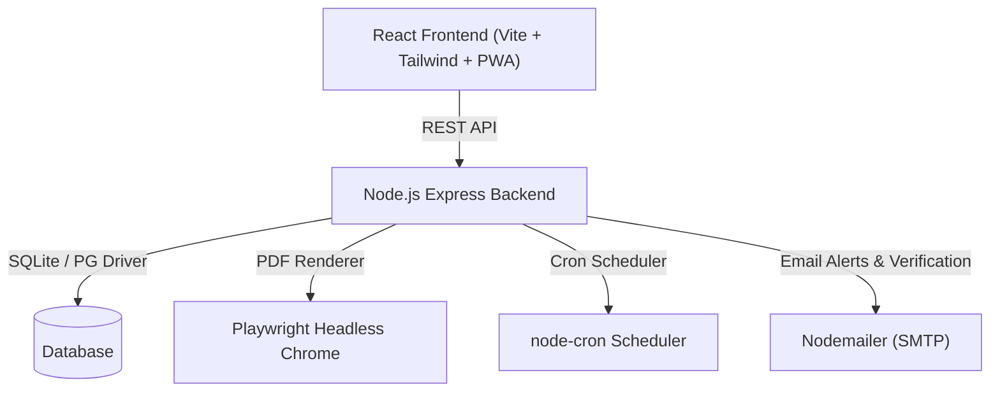

# Memotrix System Architecture

## Overview
Memotrix is a full-stack Product Billing, receipt generator, and business management application.

## Security & Single Admin Model
- **Single Permanent Admin**: Tied permanently to `teammemotrix@gmail.com`.
- **Immutable Email**: `teammemotrix@gmail.com` cannot be changed via any UI or API endpoint.
- **3-Factor Verified Password Changes**: Current password + Email Verification Code + TOTP Code.
- **Single Session Enforcement**: Active session token checked per request.

## Product Billing Workflow & Persistent Draft State
- **App-Level State Store**: Form state (`selectedCustomer`, `newCustomerName`, `lineItems`, `paymentMethod`, `notes`, etc.) is managed outside individual page routes in `CartContext.jsx`.
- **Client-Side Persistence**: Synchronized continuously to `localStorage` under key `memotrix-billing-draft`. Survived tab navigation, component unmounting, and browser refreshes.
- **Server-Side Draft Backup**: Synced to backend endpoints (`GET /api/bills/draft/current`, `POST /api/bills/draft/save`, `DELETE /api/bills/draft/clear`) every 20 seconds and via `navigator.sendBeacon` on `beforeunload`.
- **UI Save Status & Restore Banner**: Live status indicator (`✓ Draft Auto-Saved`) and a restore notification banner (`We restored your unfinished bill from [time]`).
- **Automatic Destruction**: Drafts are automatically wiped upon successful invoice generation and upon admin session logout.

## Invoice Line Items & Free-Text Billing
- **Catalog-Linked Line Items**: Linked via `product_id`. Automatically deducts inventory stock.
- **Free-Text Custom Line Items**: Manually entered with `product_id` set to `null`. Name, rate, quantity (default 1), and discount are snapshotted directly on the line item. No stock deduction is performed for free-text items.

## Logo Upload & Auto-Compression
- **Automatic Server-Side Compression**: Uploaded raster images (PNG, JPG, JPEG) up to 25MB are accepted silently.
- **Max Dimensions**: Automatically resized to a maximum of 1200px on the longest side (preserving aspect ratio and transparency). Vector SVGs pass through untouched.

## Database & Session Storage Architecture (SQLite Decision)
- **Database Engine**: SQLite (`memotrix.sqlite`) is used for single-tenant, single-admin deployment simplicity.
- **Tradeoffs & Rationale**: Eliminates external database daemon maintenance (PostgreSQL/MySQL). High-speed local read/write performance.
- **Encrypted Snapshots**: Automated daily encrypted backups (AES-256-GCM) performed by `backupService.js`, saving snapshots to local disk and optional cloud object storage (S3/GCS).
- **Session Architecture**: Token-based authentication using JWT. Single active session enforcement is tracked directly in `users.active_session_token` column in SQLite without requiring an external Redis server.

## PDF Disk Caching & Invalidation Architecture
- **Single Generation**: On first download request, Playwright generates the PDF once and persists it to `backend/storage/pdfs/${bill_number}.pdf`.
- **Cache Persistence**: `pdf_path` and `pdf_generated_at` are stored on the `bills` record. Subsequent download requests stream the cached PDF file directly.
- **Selective Invalidation**: Status updates (`PATCH /api/bills/:id/status`) do NOT invalidate `pdf_path`, preventing unnecessary PDF regenerations on status flips. Content edits (`PUT /api/bills/:id`) within the 24-hour edit window clear `pdf_path` and delete the cached file on disk so the next download regenerates fresh content. Administrative force-regeneration (`POST /api/bills/:id/regenerate-pdf`) allows manual cache updates on demand.
