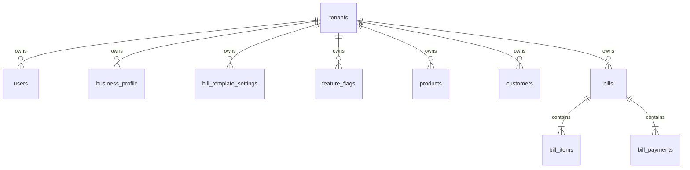

# Multi-Tenant Database Schema Documentation

## Multi-Tenant Isolation
- **`tenants`**: Represents independent business instances.
- **`users`**: Has `tenant_id` (nullable for `super_admin`) and `admin_level` ('super_admin'|'tenant_admin').
- All tenant business entities (`products`, `customers`, `bills`, `inventory_adjustments`, `coupons`) carry a `tenant_id` foreign key.
- **`bill_template_settings`**: Tenant-scoped customizable invoice fields (Executed By label/value, Terms & Conditions, footer disclaimers).
- **`feature_flags`**: Tenant-scoped feature toggles (`barcode_enabled`, `loyalty_enabled`).

## Recent Schema Enhancements
- **`users` Table**:
  - `must_reset_password` (BOOLEAN): Security flag forcing unauthenticated password reset via email verification code sent to `teammemotrix@gmail.com` when default credentials are rotated or invalidated.
- **`bills` Table**:
  - `customer_email` (TEXT): Denormalized customer email stored on the bill snapshot.
  - `pdf_path` (TEXT): File path to cached PDF on disk (`backend/storage/pdfs/${bill_number}.pdf`).
  - `pdf_generated_at` (TIMESTAMP): Timestamp of initial or regenerated PDF caching.
